<p align="center">
    <picture>
      <source
        media="(prefers-color-scheme: dark)"
        srcset="assets/icon/logo-hotelqu.png"
        width="180"
      >
      
    </picture>
</p>

<h3 align="center">
A Flutter application for performance management and presence employee hotel.
</h3>

## 🚀 Overview

Hoteque App is a hotel management application designed to facilitate the management of various aspects of hotel operations. The application provides features such as employee management, employee attendance tracking, and scheduling. With an intuitive interface and comprehensive features, Hoteque App helps improve efficiency and productivity in hotel management.

[](https://github.com/flutter/flutter/blob/main/CHANGELOG.md#3320)

## 🛠️ Tech Stack & Libraries

- **Framework:** [Flutter](https://flutter.dev) (Dart)
- **State Management:** Provider
- **Architecture:** Clean Architecture
- **Maps:** Google Maps API
- **Backend:** Golang (Gin Framework) [https://github.com/OrryFrasetyo/go-api-hotelqu]
- **Local Storage:** Shared Preferences (for Session)
- **UI Design:** Figma

## ✨ Features

### Authentication

- **Login & Registration** - Secure user authentication system
- **Session Management** - Persistent login sessions using device preferences
- **Password Security** - Character masking for password fields

### Profile Employee

- **View Profile** - Employee can view their profile information.
- **Update Profile** - Employee can update their profile details.

### Schedule Management

This feature can only be accessed by employees who hold the position of manager or supervisor.

- **Add Schedule** : Create schedule employee.
- **Edit Schedule** : Edit schedule employee.
- **List Schedule** : Displays a list of employee schedules in one department.
- **Delete Schedule** : Delete schedule employee
- **List Schedule individual** : Displays list schedule individual.
- **Schedule Now** : Display schedule now employee.

### Attendance Management

- **Clockin** : Fill presence clockin.
- **Clockout** : Fill presence clockout.
- **Detection fake gps** :
  Employees can't fill in attendance using fake gps
- **List attendance** : list attendance this month, today, and 3 days ago.

### Performance Management

Coming soon :D

## 💻 Installation & Run

1. **Clone the repository**
   ```bash
   git clone https://github.com/OrryFrasetyo/hoteque_app.git
   ```
2. **Install dependencies**
   ```
   cd hotelque-app
   flutter pub get
   ```
3. Configure 

## 📸 App Previews

<table align="center">
  <tr>
    <td align="center"><b>Home Dashboard</b></td>
    <td align="center"><b>Geolocation Attendance</b></td>
  </tr>
  <tr>
    <td>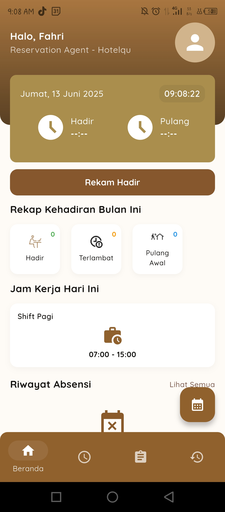</td>
    <td>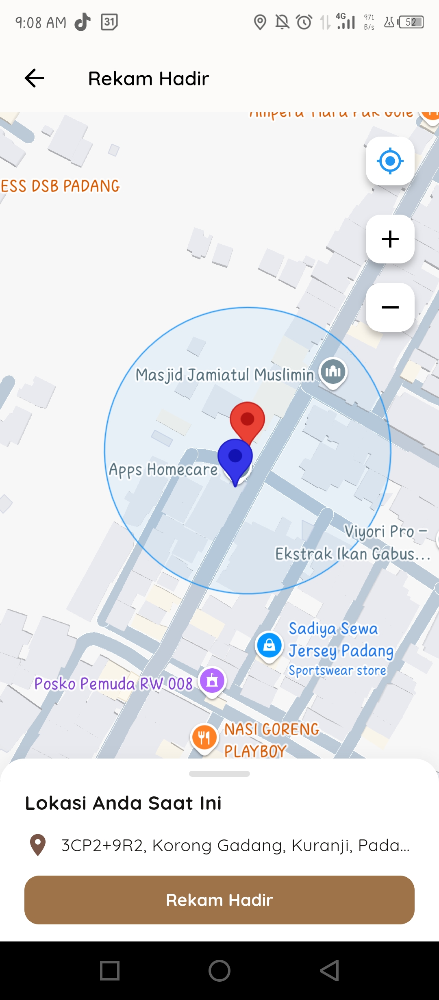</td>
  </tr>
   <tr>
    <td align="center"><b>Schedule</b></td>
    <td align="center"><b>Anti-Fake GPS</b></td>
  </tr>
  <tr>
    <td>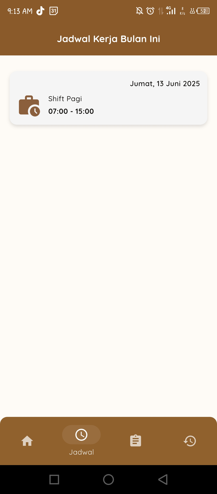</td>
    <td>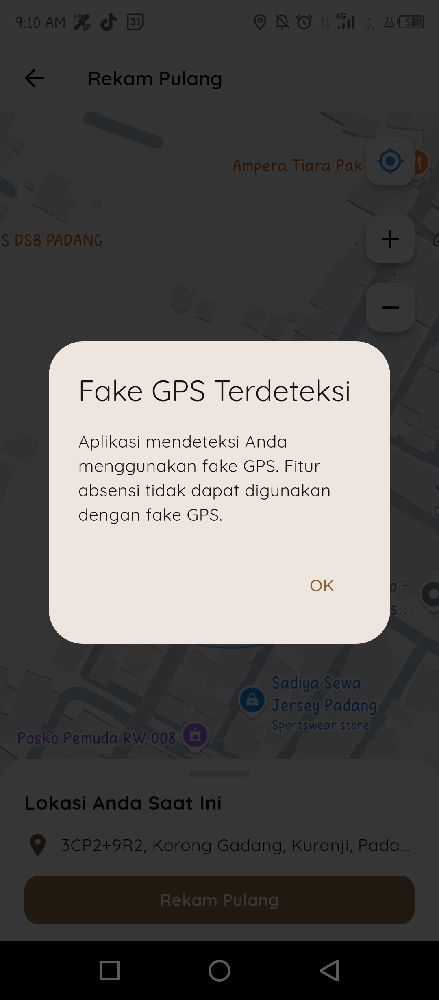</td>
  </tr>
</table>

<br>

<details>
<summary><b>See More Screenshots (Splash, Login, Profile, etc)</b></summary>
<br> <details>
  <summary>Splash & Walkthrough</summary>
  <br>
  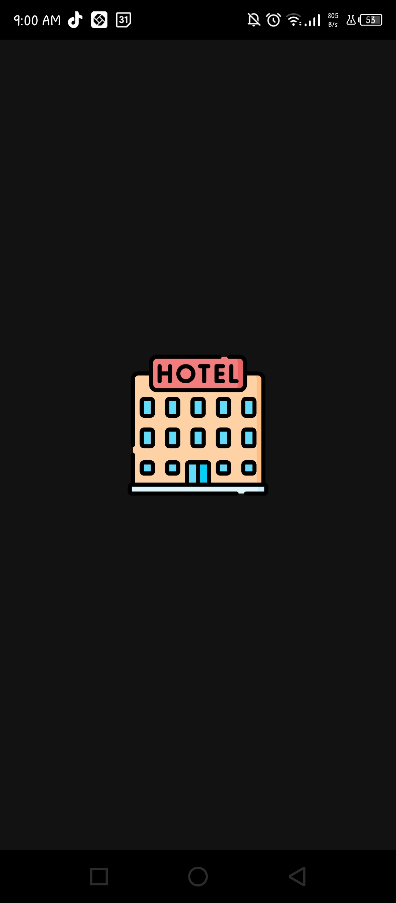
  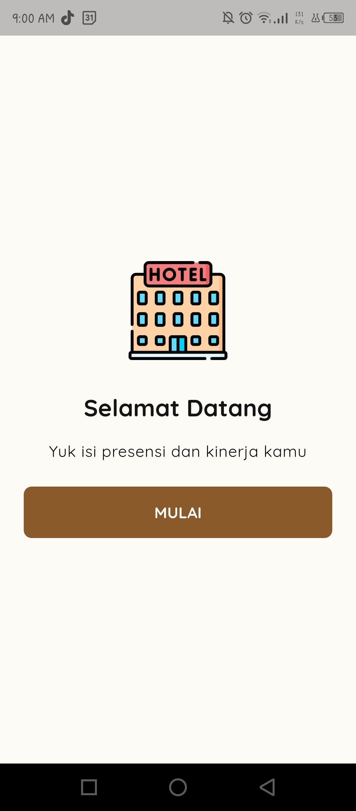
  </details>

  <details>
  <summary>Login - Register</summary>
  <br>
  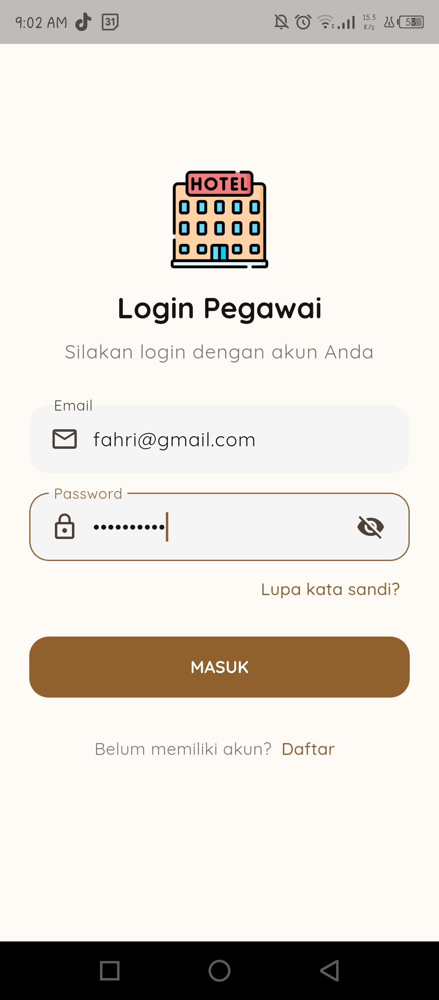
  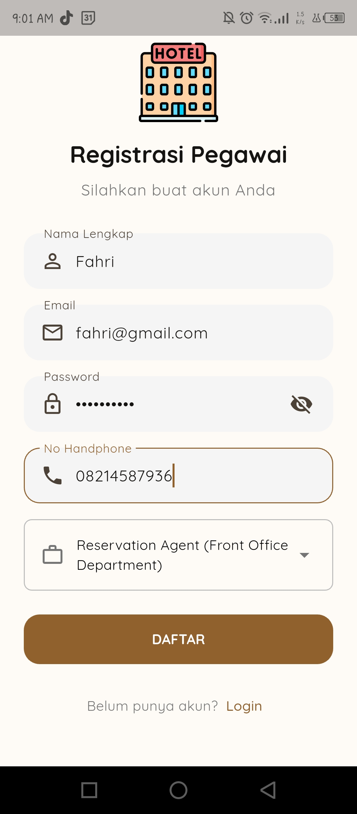
  </details>

  <details>
  <summary>Profile</summary>
  <br>
  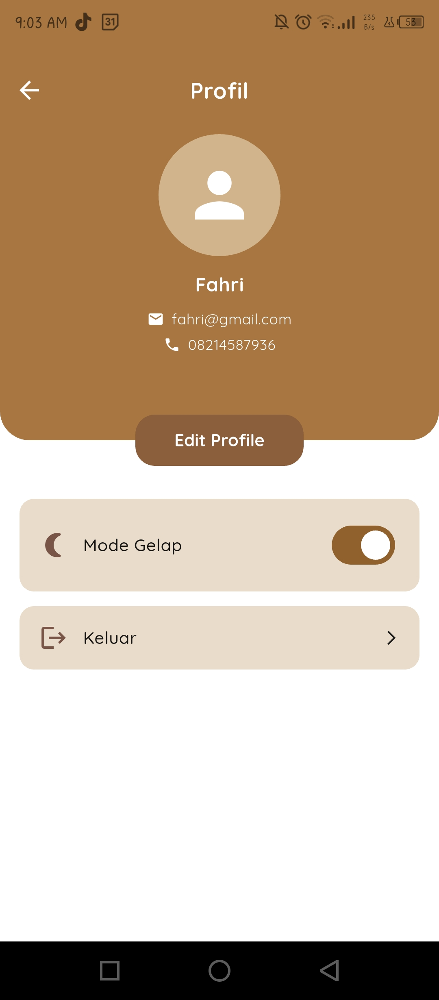
  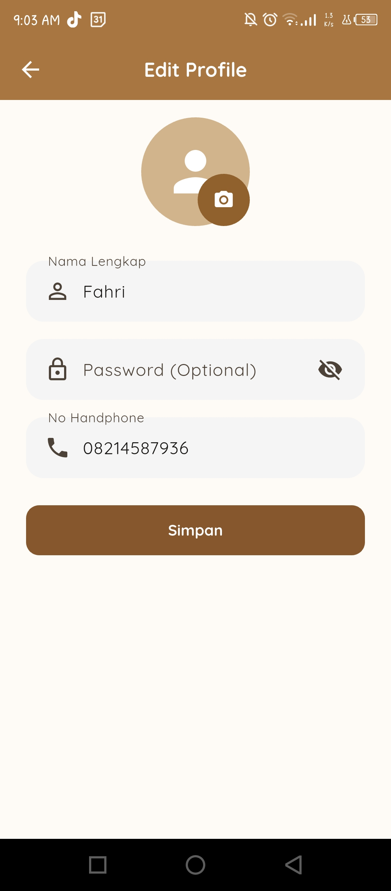
  </details>

  <details>
  <summary>Schedules Management</summary>
  <br>
  
  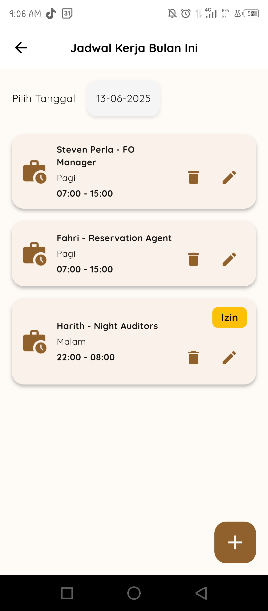
  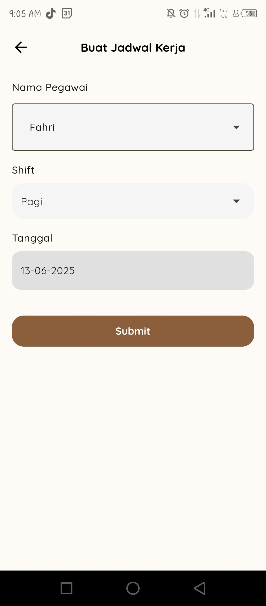
  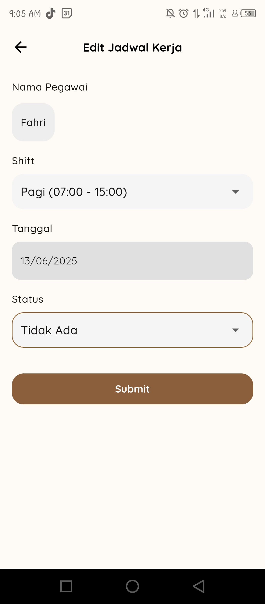
  </details>

  <details>
  <summary>Attendance History</summary>
  <br>
  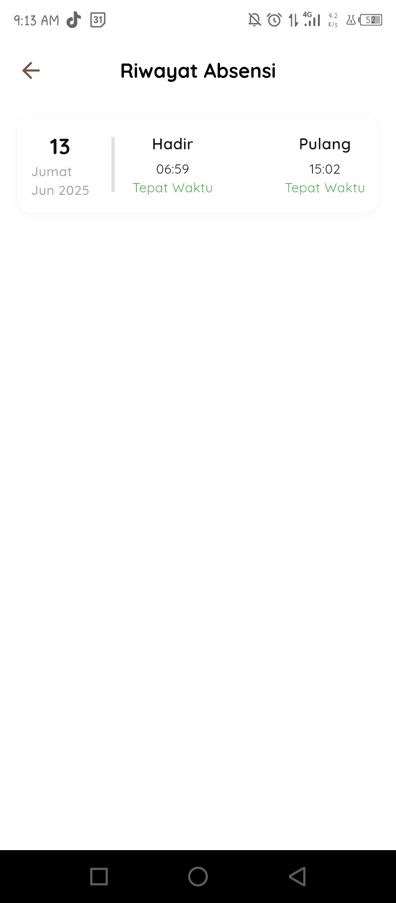
  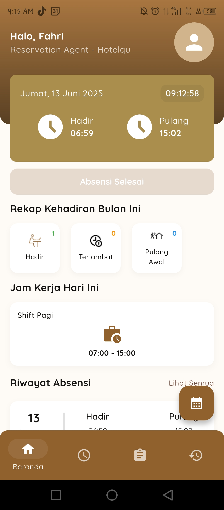
  </details>

<br>
</details>

## Prototype App

To design the project, open link figma [here](https://www.figma.com/design/9QfOItvYLU1D6HOIlJ7iMz/Presensi-dan-Manajemen-Kinerja-Karyawan--Hotel?node-id=0-1&p=f&t=8s9CMBpBprDGfXgX-0)

## License

[Apache Version 2.0](LICENSE)

```text
Copyright 2025 Orry Frasetyo

Licensed under the Apache License, Version 2.0 (the "License");
you may not use this file except in compliance with the License.
You may obtain a copy of the License at

    http://www.apache.org/licenses/LICENSE-2.0
```
